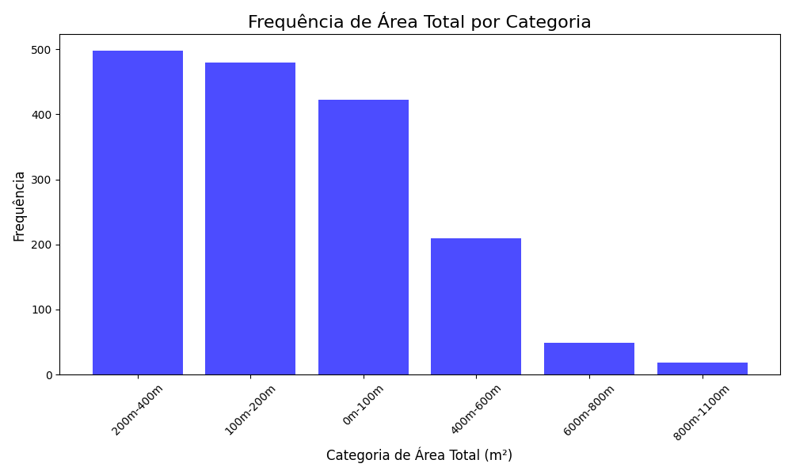

# C318_Project
Repositorio criado para trabalho em grupo da disciplina de C318

# 1- Dataset:
    Foi usado um dataset para avaliar o valor das casas em ponta grossa:
    As variaveis do dataset são:
    #1 -> Referência
    #2 -> Quartos
    #3 -> Banheiros
    #4 -> Suítes
    #5 -> Vagas de Garagem
    #6 -> Bairro,Área Total
    #7 -> Valor Venda

# 2- Foi avaliado grafico de cada variavel para verificar anormalidade:

    Percebemos que tinham linhas que não continham os valores de alguma variavel, resolvemos descarta-las e seguir com apenas as que tinham linhas completa.
    

# 3- Foi avaliado novos graficos para verificar se o dataset estava normalizado:

    De fato agora os valores estavam melhores e foram retirados as linhas que estavam sem valores.

 # 4- Treinamento do modelo:

    Utilizamos o XGBoost para treinar o modelo, usando o grid para ter os melhores parametros

# 5- Importancia de cada caracteristica:
    A importancia de cada caracteristica para o preço:
    #1 - Área total 
    #2 - Banheiros
    #3 - Garagem
    #4 - Quartos
    #5 - Suítes

# 6- Metricas:
    Utilizamos as metricas RSME e MAE.
    O RSME É a raiz quadrada da média dos erros quadráticos. O RMSE penaliza erros maiores mais fortemente do que o MAE, devido à elevação ao quadrado. Isso torna o RMSE útil para cenários onde erros grandes são mais indesejáveis.

    O MAE É a média dos erros absolutos entre as previsões e os valores reais. O MAE dá uma ideia de quanto, em média, as previsões estão afastadas dos valores reais, sem considerar a direção do erro (positiva ou negativa). Ele é mais interpretável, pois é uma média das distâncias absolutas.

# 7- Resultados:
    
    ## Primeiro resultados:
    
    RMSE: 533.1920646953762
    MAE: 172451.31370192306

